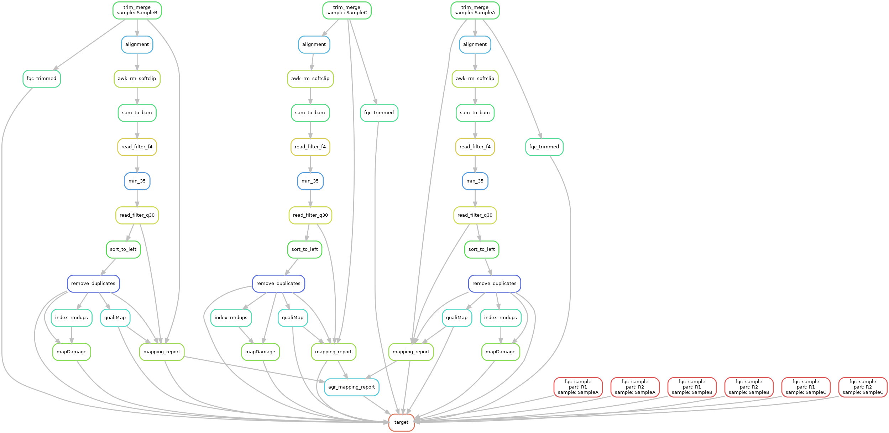

# MitoPipe
Snakemake computational pipeline for whole mitochondrial genome assembly. 

*Emery MV, Ghafoor S, Bolhofner K, Winingear S, Oldt R, Kanthaswamy S, Buikstra J, Fulginiti L, Stone AC. 2021. Whole Mitochondrial Genome Assembly from Highly Incinerated Forensic Bones and Teeth. Forensic Science International: Genetics. In preparation*

## Pipeline information
This pipeline pipeline is composed of 16 sub-steps. It produces a individual report for each sample after each step  as it moves through the pipeline as well as a master report which is an aggregation of all individual reports and adds a table to a final MultiQC report. The 16 steps are

1. **trim_merge** - trim and merge two pair ended fastq files into a single merged fastq using [leeHom](https://github.com/grenaud/leeHom).
2. **alignment** - align the merged fastq to the reference fasta using [bwa mem](https://github.com/lh3/bwa).
3. **awk_rm_softclip** - use an awk inline command to remove softclips from the sample. Alternatively, samclip can also be used for this however we found the awk script to work best with our samples. 
4. **sam_to_bam** - convert the sam file to bam using [samtools](https://github.com/samtools/samtools).
5. **read_filter_f4** - Filter out reads using [samtools](https://github.com/samtools/samtools).
6. **min_35** - Using a combination of samtools and awk pipes, keep min 35 reads.
7. **read_filter_q30** - Use samtools to skip alignments with MAPQ smaller than 30. 
8. **sort_to_left** - Sort the bam files using the leftmost coordinates using [samtools](https://github.com/samtools/samtools).
9. **remove_duplicates** - Remove duplicate reads using [samtools rmdup](https://github.com/samtools/samtools). *Note: rmdup is obsolete and it is recommended to use markdup instead however we had mixed results with it*.
10. **index_rmdups** - Index the bam files generated by **remove_duplicates** step. The index files are required for the mapDamage step and is generated using [samtools](https://github.com/samtools/samtools).
11. **mapDamage** - Track and quantify DNA damage patterns using [mapDamage](https://ginolhac.github.io/mapDamage/).
12. **qualiMap** - Evaluate sequencing alignment data using [QualiMap](http://qualimap.conesalab.org/).
13. **mapping_report** - Create an individual mapping report for each sample using combination of python and bash.
14. **agr_mapping_report** - Aggregate all individual mapping reports into a single master report. 
15. **fqc_trimmed** - Run fastqc on the trim and merged fastq that is output by [leeHom](https://github.com/grenaud/leeHom).
16. **fqc_sample** - Run fastqc on each of the original pair ended fastq file. 
17. **target** - Create a master multiqc file with reports from all individual steps for each sample as well fastqc reports. 

The authors acknowledge Research Computing at Arizona State University for providing high-performance computing resources that have contributed to the research results.
